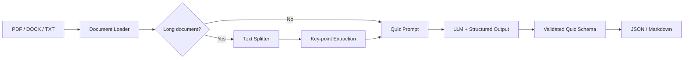
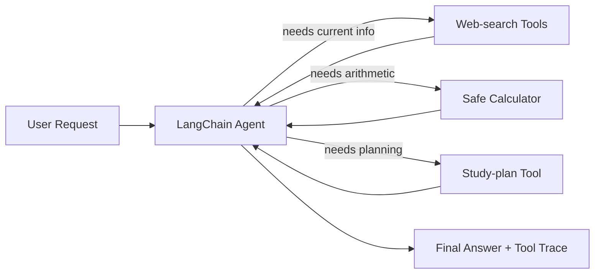

# LangChain Chain vs Agent — Two Practical LLM Demos

A compact portfolio repository that demonstrates **two different LangChain application patterns**:

1. **English Quiz Generator (Chain / Workflow)** — a deterministic document-to-quiz pipeline.
2. **Campus Life Assistant (Agent)** — an agent that decides when and how to call external or deterministic tools.

The goal is not to build two large products. It is to show a clear engineering distinction:

> **Use a Chain when the processing path is known in advance; use an Agent when the model must choose actions dynamically.**

## Project Overview

| Project | Pattern | Core capability | What it demonstrates |
|---|---|---|---|
| `chain_question_generator` | Chain / LCEL-style workflow | Load an English article and generate a structured quiz | prompt composition, document loading, long-text handling, structured output |
| `agent_campus_assistant` | Agent + tools | Answer campus-life questions and dynamically call tools | tool design, tool selection, multi-step execution, source-aware search |

## Architecture

### 1. English Quiz Generator



### 2. Campus Life Assistant



## Key Improvements over the Original Learning Demo

The original campus assistant intentionally implemented its own ReAct-style loop. This repository keeps that version under `legacy/` for comparison, while the main implementation is refactored for a cleaner portfolio presentation.

- Replaces regex-based `Action:` parsing with LangChain's native agent/tool-calling abstraction.
- Replaces Python `eval()` with a restricted AST-based calculator.
- Splits model configuration, tools, and CLI entry points into small modules.
- Uses standard environment-variable names and includes `.env.example`.
- Adds typed/structured quiz output with Pydantic instead of free-form JSON parsing.
- Adds deterministic tests that do not require API keys.
- Keeps generated files and secrets out of Git with `.gitignore`.

## Quick Start

```bash
git clone <your-repo-url>
cd langchain-chain-agent-portfolio
python -m venv .venv
```

Activate the environment, then install dependencies:

```bash
pip install -r requirements.txt
cp .env.example .env
```

Fill in your API keys in `.env`.

### Run the Chain demo

```bash
python -m chain_question_generator.main \
  --file chain_question_generator/examples/sample_article.txt \
  --num-questions 5 \
  --output outputs/quiz.json
```

### Run the Agent demo

```bash
python -m agent_campus_assistant.main
```

Example prompts:

```text
What is the weather in Boston today? Give me one clothing suggestion.
I have 90 minutes tonight: reading, vocabulary review, and a 20-minute break. Make a plan.
What is 18 * 30 + 12?
```

## Repository Structure

```text
.
├── README.md
├── requirements.txt
├── .env.example
├── chain_question_generator/
│   ├── __init__.py
│   ├── config.py
│   ├── loaders.py
│   ├── schemas.py
│   ├── pipeline.py
│   ├── main.py
│   └── examples/
│       └── sample_article.txt
├── agent_campus_assistant/
│   ├── __init__.py
│   ├── config.py
│   ├── tools.py
│   ├── agent.py
│   └── main.py
├── tests/
├── legacy/
│   └── campus_assistant_original.py
└── .github/workflows/tests.yml
```

## Design Notes

### Why the quiz generator is a Chain

Its stages are known before execution: load document → prepare context → generate quiz → validate/save output. The model generates content, but it does not need to decide which operation to perform next.

### Why the campus assistant is an Agent

Different user requests require different actions. A weather question needs fresh search; arithmetic needs deterministic calculation; planning can be solved with a specialized local tool; ordinary conversational requests may need no tool at all. The action path therefore depends on the request.

## Testing

The included tests cover deterministic components and do not call external APIs:

```bash
pytest -q
```

## Possible Extensions

- Add a Streamlit or Gradio front end.
- Add LangSmith traces/evaluation for tool-selection accuracy.
- Add a small benchmark set for quiz quality and agent routing.
- Add conversation memory to the campus assistant.
- Replace general web search with school-specific APIs or a campus RAG knowledge base.

## Portfolio Talking Point

A concise interview explanation:

> I built two LangChain demos to understand the boundary between workflows and agents. For the quiz generator, the execution path is fixed, so I used a Chain with structured output. For the campus assistant, the path depends on the user's intent, so I used an Agent that dynamically selects tools such as web search, calculation, and planning. I later refactored the prototypes into a modular repository with safer tool execution, typed outputs, tests, and reproducible configuration.
